## Building Intelligent Agents with Google ADK and Apigee MCP Tools

## Introduction

The Google Agent Development Kit (ADK) is a powerful framework for building, running, and managing AI-powered agents. These agents can understand natural language, make decisions, and interact with various tools and services to accomplish complex tasks. When combined with Apigee and Model Context Protocol (MCP) toolsets, ADK agents can securely and efficiently leverage backend systems and APIs, enabling sophisticated automation across different business domains.

<p align="center">
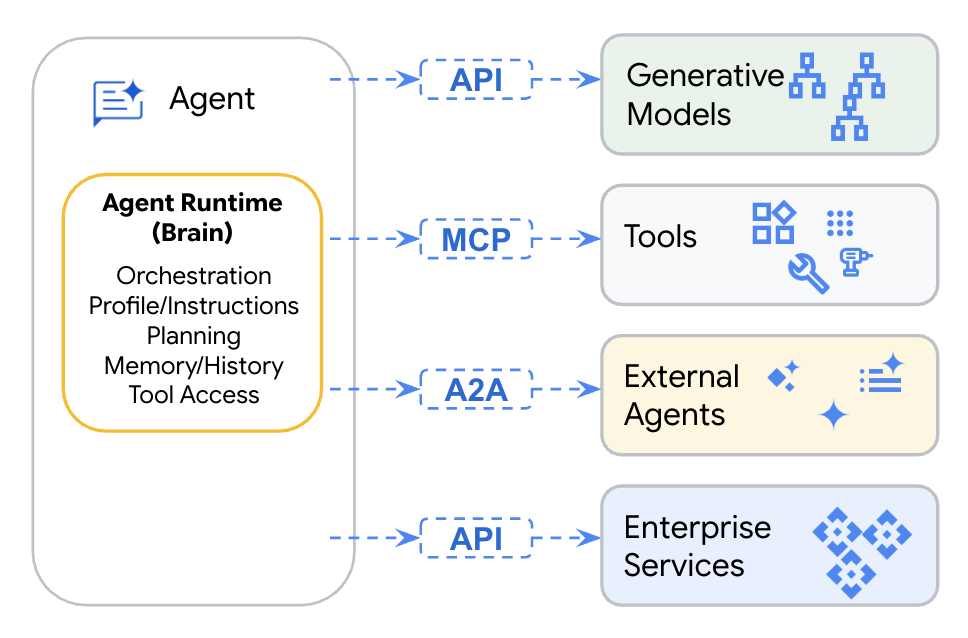
</p>

## Lab Overview

This lab will guide you through running three distinct AI agents using the Google ADK: a Customer Relationship Management (CRM) agent, an Order Management System (OMS) agent, and a Warehouse Management System (WMS) agent. You will execute these agents from Jupyter notebooks within a Colab Enterprise environment, configured to use your Qwiklabs project. Each agent interacts with a dedicated Apigee-hosted MCP toolset, and you'll observe their operation by sending them natural language queries.

### <b>What you’ll build</b>

In this lab, you'll:
*   Configure and run Google ADK agents using notebooks in Colab Enterprise.
*   Retrieve pre-provisioned API keys from the Apigee UI within your Qwiklabs project.
*   Execute a CRM Agent to handle customer data inquiries.
*   Execute an OMS Agent for order processing and product availability checks.
*   Execute a WMS Agent for warehouse operations and fulfillment tasks.
*   Observe how these agents utilize Apigee-hosted MCP toolsets.

### <b>What you’ll learn</b>
*   How to navigate the Apigee UI to find developer apps and their API keys.
*   How to set up and run ADK notebooks in a Colab Enterprise environment.
*   The basic structure of an ADK Agent and how it uses tools.
*   How to configure an agent to connect to an MCP server using parameters from your Qwiklabs environment.
*   The general flow of an agent's execution and its interaction with external tools.
*   The concept of specialized agents for different business functions (CRM, OMS, WMS).

## <b>Labs Pre-requisites</b>

For this lab, you will need:

*   Access to a Qwiklabs environment. (We've provisioned it for you.)
*   A Google Cloud Project provided by Qwiklabs with Vertex AI services pre-enabled. (We've provisioned it for you.)
*   An Apigee instance provisioned by Qwiklabs, with MCP proxies for CRM, OMS, and WMS tools, and corresponding developer apps pre-deployed. (We've provisioned it for you.)
*   Access to the public GitHub repository: `https://github.com/ra2085/apigee-adk-workshop` containing the notebooks.
*   A modern web browser like Chrome (v50+) to access the Qwiklabs environment and notebooks.

For this lab, you will need access to the Google Cloud Platform (GCP) project provided by Qwiklabs. To get this, click on the <b>Start Lab</b> button on the left panel of this lab.

<p align="center">
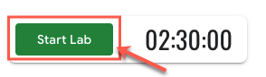
</p>

<ql-infobox><strong>Note</strong>: The lab may take a few minutes for provisioning all the resources. Once provisioning is completed, you can perform the lab.</ql-infobox>

This will generate a student project on GCP. This project will be available to you for the duration of this lab. Note down your <b>GCP Project ID</b>, <b>Username</b>, and <b>Password</b> from the Qwiklabs connection panel.

<p align="center">
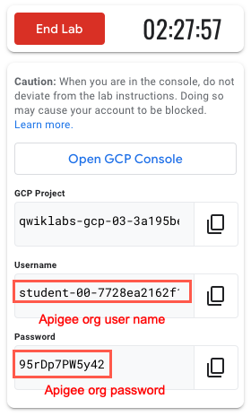
</p>

<br>&nbsp;
Right click on the **Open GCP Console**, select to **Open Link in Incognito Window**.
Log in using the lab credentials (Username and Password) found on the left.

<p align="center">
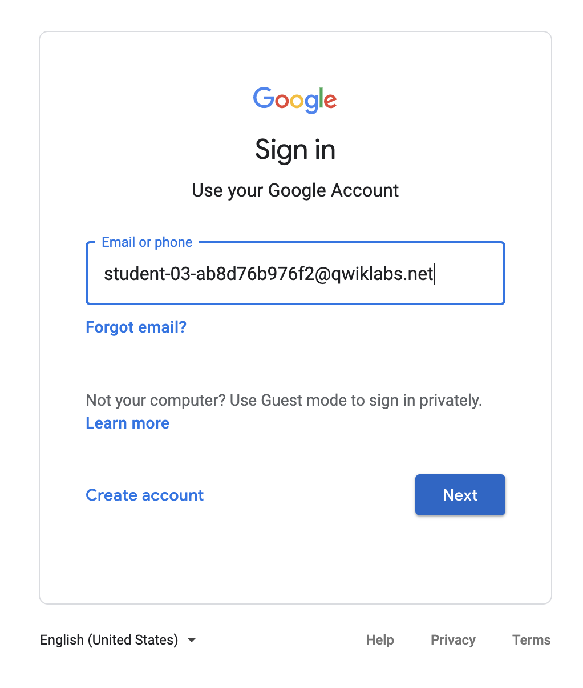 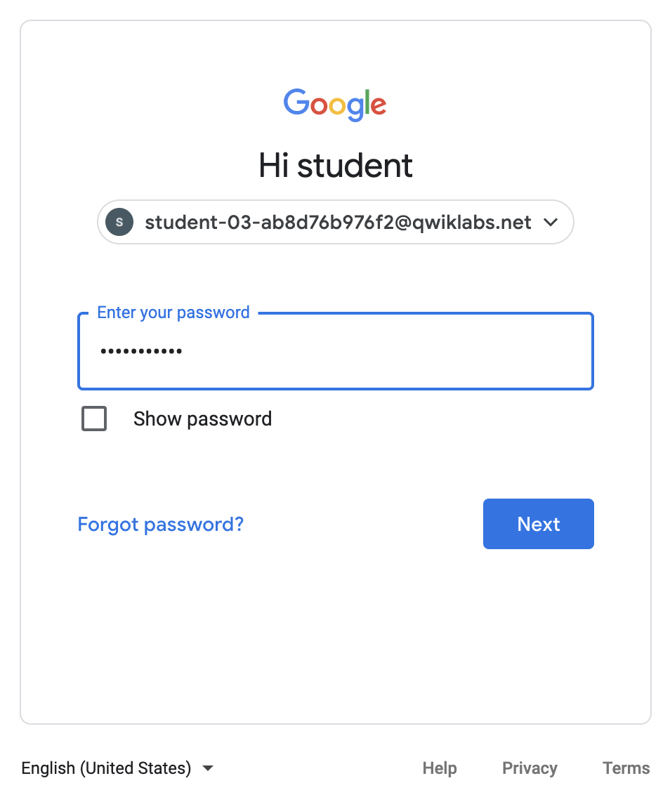
</p>

You will need to click "<b>Accept</b>" on the next screen, to accept the Google Terms of Service and the Google Privacy Policy.

<p align="center">
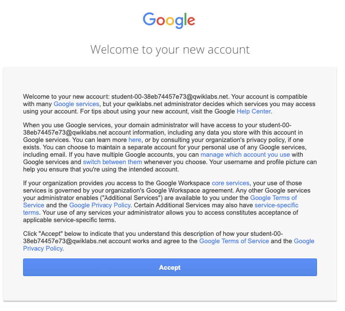
</p>

The next screen may ask you to confirm account protection settings. Click "<b>Confirm</b>".

<p align="center">
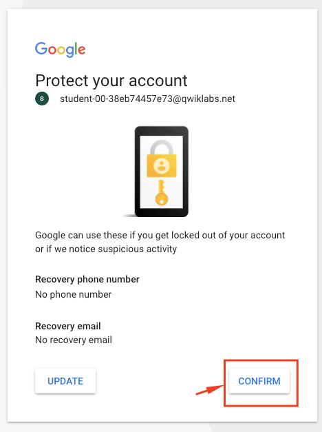
</p>

<br>&nbsp;

You should then be led to the Google Cloud Console. Ensure that the selected project is the same as the <b>GCP Project ID</b> specified in the Qwiklabs environment.

<p align="center">
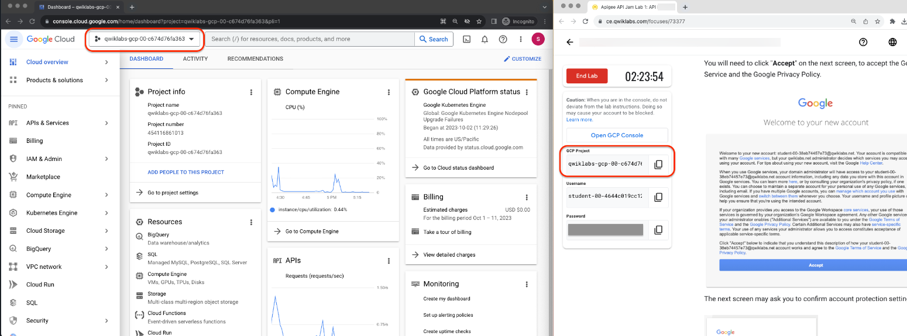
</p>

**NOTE**: Your Apigee Host will be in the format `api-YOUR_QWIKLABS_PROJECT_ID.apiservices.dev`. You will use this, your Qwiklabs Project ID, and the API Keys (which you will retrieve in the next section) to execute the labs.

## Retrieve API Keys from Apigee UI

The necessary Developer Apps and their API keys (also known as Consumer Keys) have been pre-provisioned in your Apigee environment. You will need to retrieve these keys to configure the agents in the notebooks.

1.  **Navigate to Apigee**:
    In the GCP Console, use the search bar at the top and type "Apigee". Select "Apigee API Management" from the results.

    <p align="center">
    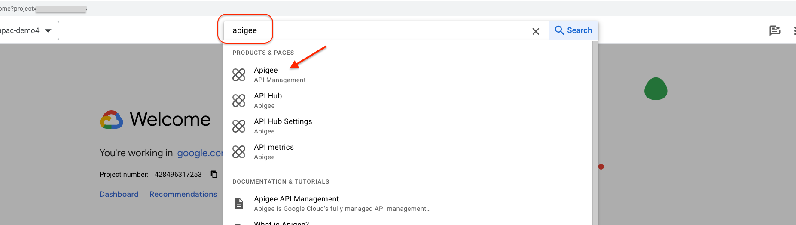
    </p>

    You will be redirected to the Apigee Overview page.

    <p align="center">
    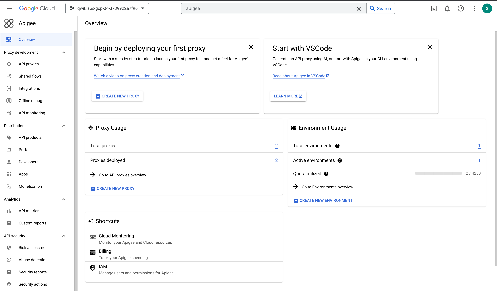
    </p>

2.  **Access Developer Apps**:
    In the Apigee UI, navigate to **Publish > Apps** using the left-hand side navigation menu.

    <p align="center">
    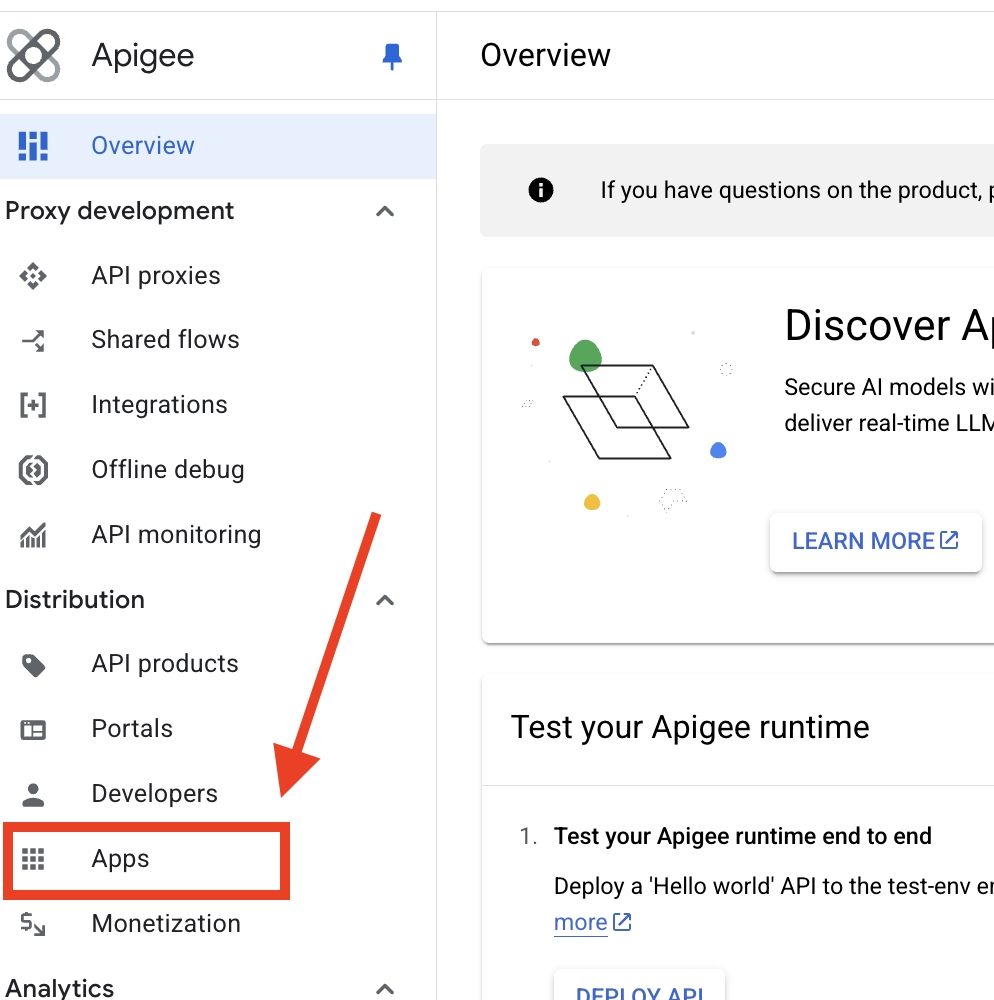
    </p>

    <p align="center">
    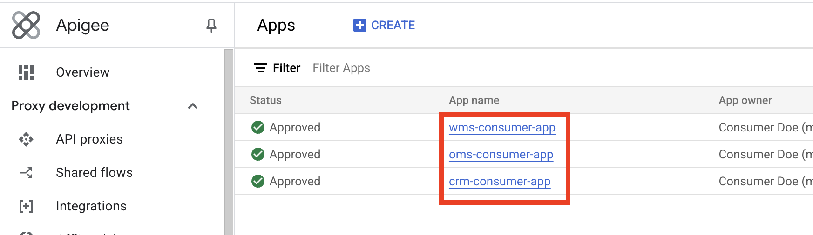
    </p>

3.  **Retrieve CRM API Key**:
    *   In the list of apps, find and click on **crm-consumer-app**.
    *   On the `crm-consumer-app` details page, you will see a "Credentials" section.
    *   Locate the **Key** (this is your API Key / Consumer Key).
    *   Click the copy icon next to the Key to copy it to your clipboard.
    *   **Save this key.** You will need it for the CRM Agent notebook.

    <p align="center">
    <!-- Placeholder: Image showing crm-consumer-app details page with Key highlighted -->
    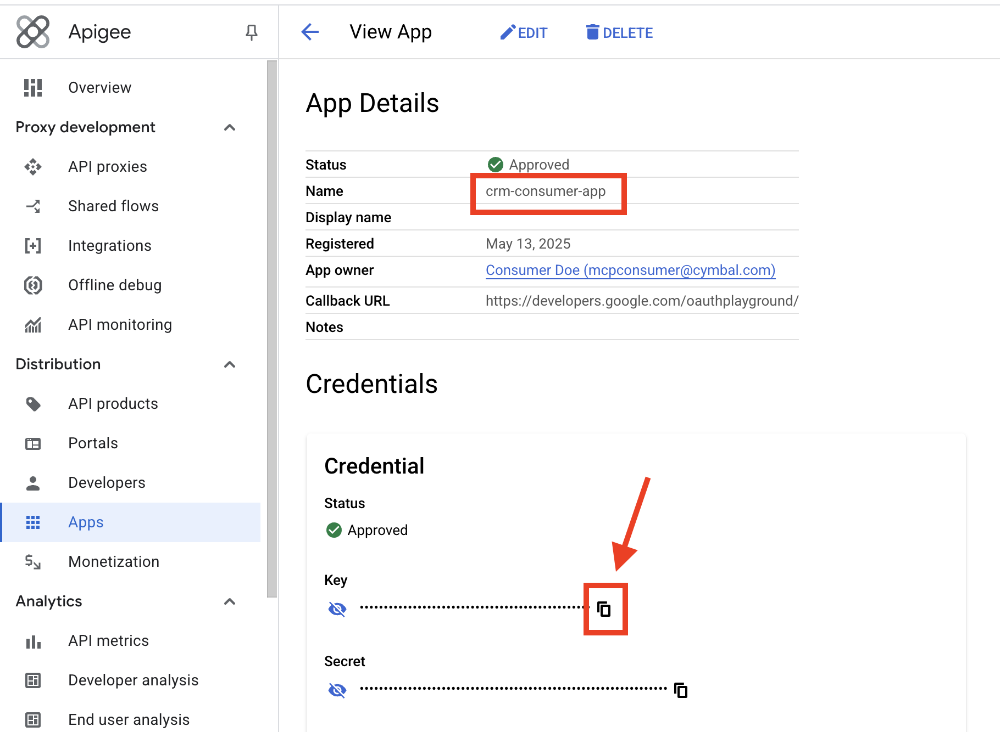
    </p>

4.  **Retrieve OMS API Key**:
    *   Go back to the list of Developer Apps (Publish > Apps).
    *   Find and click on **oms-consumer-app**.
    *   In the "Credentials" section, locate and copy the **Key**.
    *   **Save this key.** You will need it for the OMS Agent notebook.

5.  **Retrieve WMS API Key**:
    *   Go back to the list of Developer Apps.
    *   Find and click on **wms-consumer-app**.
    *   In the "Credentials" section, locate and copy the **Key**.
    *   **Save this key.** You will need it for the WMS Agent notebook.

<ql-infobox><strong>Important</strong>: Keep these three API keys (CRM, OMS, WMS) readily available. You will need to paste them into the respective Jupyter notebooks.</ql-infobox>

## Setup Instructions for Notebooks

The notebooks for this lab are hosted on a public GitHub repository. The preferred way to run them is using **Colab Enterprise**, which integrates with your Qwiklabs GCP project.

1.  **Access the Notebooks**:
    Each lab section below will provide links to open the notebooks directly in Colab Enterprise.
    *   **CRM Agent**: Handles customer data.
    *   **OMS Agent**: Manages orders and product inventory.
    *   **WMS Agent**: Focuses on warehouse operations.

2.  **Common Configuration in Each Notebook**:
    When you open a notebook in Colab Enterprise:
    *   **Install Dependencies**: The first code cells use `%pip install` for necessary libraries. Run these. If prompted to restart the kernel, please do so.
    *   **Import Dependencies**: Subsequent cells import Python modules.
    *   **Set Authentication and Project Details**:
        *   Locate the cell typically under a "### Set Auth" section.
        *   You **must** replace the placeholder for `CLOUD_PROJECT` with your **Qwiklabs GCP Project ID**.
            ```python
            CLOUD_PROJECT = "YOUR_QWIKLABS_PROJECT_ID" # @param {type:"string"} <--- REPLACE THIS
            os.environ["GOOGLE_GENAI_USE_VERTEXAI"]="TRUE"
            os.environ["GOOGLE_CLOUD_PROJECT"]= CLOUD_PROJECT
            os.environ["GOOGLE_CLOUD_LOCATION"]="us-central1" # Usually pre-set
            ```
        *   These settings configure the notebook to use Vertex AI services within your project.

## Your Journey

In this lab, you will execute a suite of intelligent agents using the Google Agent Development Kit (ADK). These agents, specialized for CRM, OMS, and WMS, will leverage Apigee-hosted MCP toolsets. After retrieving your API keys:

1.  Open each agent's dedicated notebook using the "Open in Colab Enterprise" link.
2.  Run the installation and import cells.
3.  Configure the `CLOUD_PROJECT` with your Qwiklabs Project ID.
4.  Configure the MCP toolset connection parameters:
    *   **Apigee Host**: This will be `api-YOUR_QWIKLABS_PROJECT_ID.apiservices.dev`. The notebook will help construct the full `mcp_base_url`.
    *   **API Key (Client ID)**: Use the API key you retrieved from the Apigee UI for the respective toolset.
5.  Briefly review the agent's purpose as described in the notebook.
6.  Execute the notebook cells to run the agent and observe its interaction with the tools based on a sample query. For detailed code explanations, refer to the official Google ADK documentation.

This hands-on experience will demonstrate the power and flexibility of ADK in creating specialized AI agents.

## Lab 1: CRM Agent with ADK

The CRM Agent is designed to be the central authority for customer account data.

<table align="left">
    <td style="text-align: center">
        <a href="https://console.cloud.google.com/vertex-ai/colab/import/https%3A%2F%2Fraw.githubusercontent.com%2Fra2085%2Fapigee-adk-workshop%2Fmain%2Fnotebooks%2Fcrm-agent-mcp.ipynb" target="_blank">
          <br> Open CRM Agent in Colab Enterprise
        </a>
      </td>
    <td style="text-align: center">
        <a href="https://colab.research.google.com/github/ra2085/apigee-adk-workshop/blob/main/notebooks/crm-agent-mcp.ipynb" target="_blank">
          <br> Open in Colab (Public)
        </a>
      </td>
      <td style="text-align: center">
        <a href="https://github.com/ra2085/apigee-adk-workshop/blob/main/notebooks/crm-agent-mcp.ipynb" target="_blank">
          <br> View on GitHub
        </a>
      </td>
</table>
<br /><br /><br /><br />

1.  **Open and Prepare the CRM Agent Notebook**:
    Click the "Open CRM Agent in Colab Enterprise" link above.
    *   Run the "Install Dependencies" and "Import Dependencies" cells.
    *   In the "Set Auth" cell, replace the placeholder in `CLOUD_PROJECT` with your **Qwiklabs GCP Project ID**. Run this cell.

2.  **Configure Apigee MCP Tools for CRM**:
    Locate the cell under "### Get Apigee MCP Tools".
    *   The `mcp_base_url` variable will be constructed using your Qwiklabs Project ID (which you set in the "Set Auth" cell). It should look like:
        ```python
        project_id = os.environ["GOOGLE_CLOUD_PROJECT"]
        mcp_base_url = f"https://api-{project_id}.apiservices.dev/crm-mcp-proxy/sse"  # @param {type:"string"}
        ```
        Verify this line or update if necessary.
    *   Modify the `client_id` variable:
        ```python
        client_id = "PASTE_YOUR_CRM_TOOLS_API_KEY_HERE"  # @param {type:"string"} <--- REPLACE THIS
        ```
        Replace the placeholder with the **CRM API Key you retrieved from the Apigee UI**.
    Run this cell.

3.  **Execute the Agent**:
    Review the agent's purpose (managing customer profiles and addresses). The sample query is `"get details about customer 1234"`.
    Run the cells under "### Initialize Agent", "### Build Agent Runtime", and finally "### Execute Agent".
    Observe the output logs showing the agent's interaction with the CRM tools.

## Lab 2: OMS Agent with ADK

The OMS Agent acts as the central authority for managing customer orders and product inventory.

<table align="left">
    <td style="text-align: center">
        <a href="https://console.cloud.google.com/vertex-ai/colab/import/https%3A%2F%2Fraw.githubusercontent.com%2Fra2085%2Fapigee-adk-workshop%2Fmain%2Fnotebooks%2Foms-agent-mcp.ipynb" target="_blank">
          <br> Open OMS Agent in Colab Enterprise
        </a>
      </td>
    <td style="text-align: center">
        <a href="https://colab.research.google.com/github/ra2085/apigee-adk-workshop/blob/main/notebooks/oms-agent-mcp.ipynb" target="_blank">
          <br> Open in Colab (Public)
        </a>
      </td>
      <td style="text-align: center">
        <a href="https://github.com/ra2085/apigee-adk-workshop/blob/main/notebooks/oms-agent-mcp.ipynb" target="_blank">
          <br> View on GitHub
        </a>
      </td>
</table>
<br /><br /><br /><br />

1.  **Open and Prepare the OMS Agent Notebook**:
    Click the "Open OMS Agent in Colab Enterprise" link.
    *   Run installation and import cells.
    *   Set your **Qwiklabs GCP Project ID** in the `CLOUD_PROJECT` variable in the "Set Auth" cell.

2.  **Configure Apigee MCP Tools for OMS**:
    In the "### Get Apigee MCP Tools" cell:
    *   Ensure `mcp_base_url` is correctly formatted using your project ID:
        ```python
        project_id = os.environ["GOOGLE_CLOUD_PROJECT"]
        mcp_base_url = f"https://api-{project_id}.apiservices.dev/oms-mcp-proxy/sse"  # @param {type:"string"}
        ```
    *   Modify `client_id`:
        ```python
        client_id = "PASTE_YOUR_OMS_TOOLS_API_KEY_HERE"  # @param {type:"string"} <--- REPLACE THIS
        ```
        Replace with your **OMS API Key retrieved from the Apigee UI**.
    Run this cell.

3.  **Execute the Agent**:
    Review the agent's purpose (managing orders, product availability). The sample query is `"What's the stock availability for product P002?"`.
    Run the subsequent cells to initialize and execute the agent. Observe its interactions.

## Lab 3: WMS Agent with ADK

The WMS Agent is responsible for warehouse operations and order fulfillment.

<table align="left">
    <td style="text-align: center">
        <a href="https://console.cloud.google.com/vertex-ai/colab/import/https%3A%2F%2Fraw.githubusercontent.com%2Fra2085%2Fapigee-adk-workshop%2Fmain%2Fnotebooks%2Fwms-agent-mcp.ipynb" target="_blank">
          <br> Open WMS Agent in Colab Enterprise
        </a>
      </td>
    <td style="text-align: center">
        <a href="https://colab.research.google.com/github/ra2085/apigee-adk-workshop/blob/main/notebooks/wms-agent-mcp.ipynb" target="_blank">
          <br> Open in Colab (Public)
        </a>
      </td>
      <td style="text-align: center">
        <a href="https://github.com/ra2085/apigee-adk-workshop/blob/main/notebooks/wms-agent-mcp.ipynb" target="_blank">
          <br> View on GitHub
        </a>
      </td>
</table>
<br /><br /><br /><br />

1.  **Open and Prepare the WMS Agent Notebook**:
    Click the "Open WMS Agent in Colab Enterprise" link.
    *   Run installation and import cells.
    *   Set your **Qwiklabs GCP Project ID** in the `CLOUD_PROJECT` variable in the "Set Auth" cell.

2.  **Configure Apigee MCP Tools for WMS**:
    In the "### Get Apigee MCP Tools" cell:
    *   Ensure `mcp_base_url` is correctly formatted:
        ```python
        project_id = os.environ["GOOGLE_CLOUD_PROJECT"]
        mcp_base_url = f"https://api-{project_id}.apiservices.dev/wms-mcp-proxy/sse"  # @param {type:"string"}
        ```
    *   Modify `client_id`:
        ```python
        client_id = "PASTE_YOUR_WMS_TOOLS_API_KEY_HERE"  # @param {type:"string"} <--- REPLACE THIS
        ```
        Replace with your **WMS API Key retrieved from the Apigee UI**.
    Run this cell.

3.  **Execute the Agent**:
    Review the agent's purpose (managing fulfillment, shipping). The sample query is `"Can you generate a shipping label?"`.
    Run the subsequent cells to initialize and execute the agent. Observe its interactions.

## Understanding the Agent's Operation (High-Level)

Each notebook demonstrates a similar pattern for agent execution:
1.  **Setup**: Initializes services for managing session state and artifacts.
2.  **Query**: Defines a user's natural language query.
3.  **Agent Initialization**: Creates an ADK agent, providing it with instructions and tools fetched from the configured Apigee MCP server.
4.  **Execution**: A `Runner` processes the query using the agent. The notebook then iterates through events (like tool calls and responses) generated by the agent.
5.  **Cleanup**: Ensures the connection to the MCP server is properly closed.

For a deeper dive into the ADK components like `Agent`, `Runner`, `MCPToolset`, and their configurations, please consult the official Google Agent Development Kit documentation.

## Congratulations!

You've successfully configured and run three different Google ADK agents within your Qwiklabs Colab Enterprise environment! Each agent interacted with specialized tools via Apigee MCP toolsets using configurations tied to your Qwiklabs project. You've learned the fundamental steps of setting up the ADK environment from a public repository, configuring API access, and observing agent execution.

This lab demonstrates how ADK can be used to build modular, intelligent components that can automate and enhance various business processes.

<b>What’s next?</b>
To further your understanding:
*   Explore the [Google Agent Development Kit (ADK)](https://google.github.io/adk-docs/) documentation (link to official docs if available, otherwise a general search term).
*   Investigate Vertex [AI Agent Builder](https://cloud.google.com/products/agent-builder?e=48754805&hl=en) and [Agentspace](https://cloud.google.com/products/agentspace?e=48754805&hl=en) for more managed agent creation.
*   Learn more about [Apigee API Management](https://cloud.google.com/solutions/apigee-ai?e=48754805&hl=en) capabilities.
*   Experiment with different queries for the agents in the [Colab Enterprise](https://cloud.google.com/colab/docs/introduction) notebooks.
